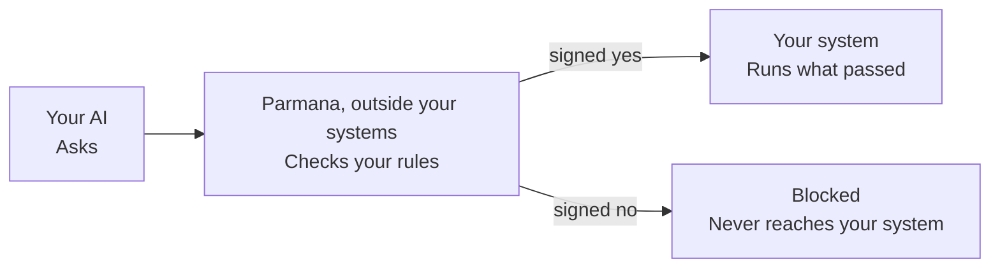
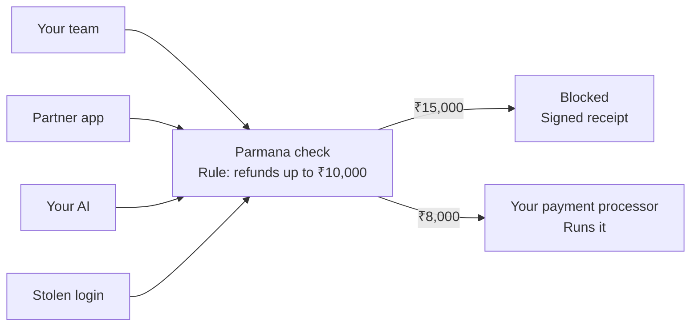
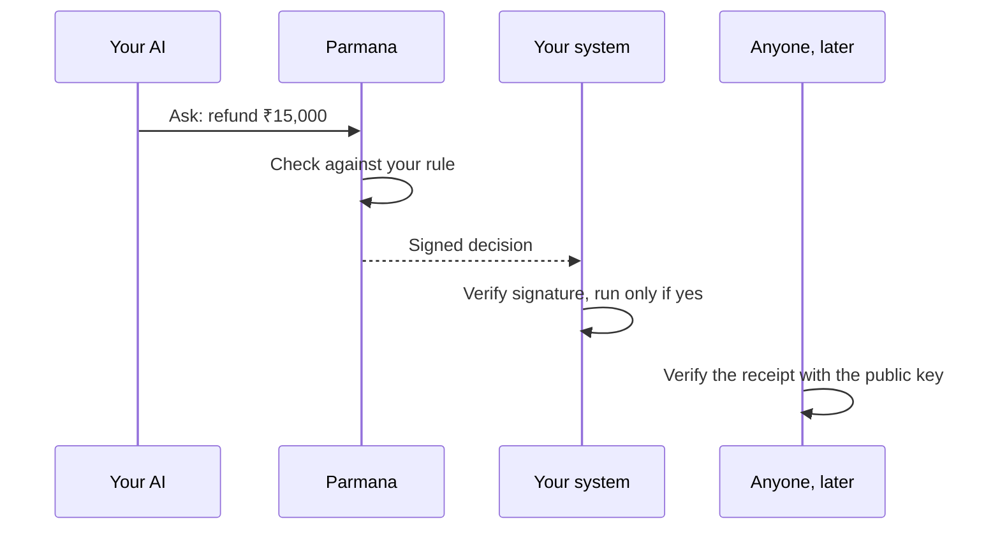
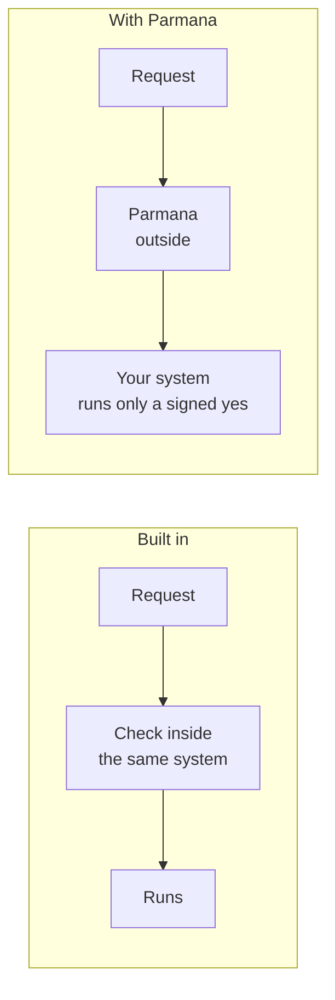
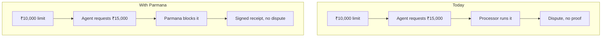
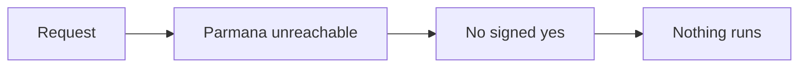
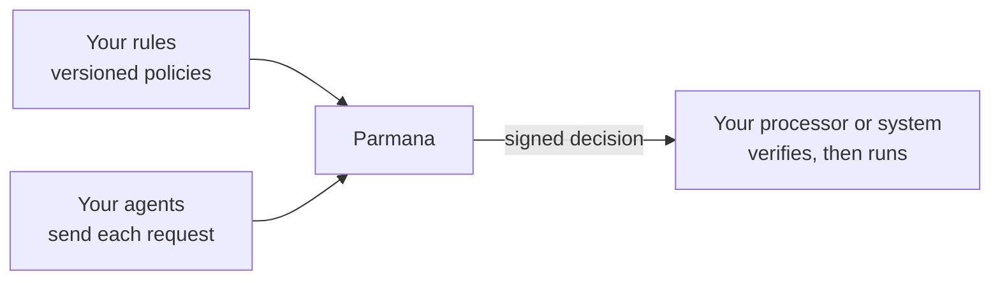

# Parmana site build prompt (revised 2026-09-28, validated against the code)

For Claude Code, working in this repo. Revision of the existing site, not a greenfield build.
Source of truth: `docs/DESIGN-SYSTEM-CURRENT.md`, `tailwind.config.ts`, `lib/config.ts`. If they
disagree with this prompt, the files win. The Explainers and SDKs pages are removed; don't bring them back.

---

## 1. The standard: Stripe, everywhere

Every page, section, sentence, diagram, and interaction is held to the bar of stripe.com. When in
doubt, ask: would Stripe ship this?

### Tone
- Calm, confident, exact. Never louder than the proof.
- No fear, no urgency theater, no countdowns, no "hackers" hooks. Lead with control and proof.
- Speak to a busy CFO or CTO as a peer. No hype, no cleverness for its own sake.

### Language
- Plain words: business rules, allowed, authorized, request, check, system, signed receipt, proof.
- One claim per sentence. Every claim true and specific. Short sentences, active voice.
- Headlines state the outcome in under 8 words. Subheads say how, in one sentence.
- Consistent nouns: always "request", "rule", "check", "signed receipt", "your system",
  "your payment processor". Never swap synonyms for variety.
- No em or en dashes. No hype words (unlock, revolutionize, AI-powered, cutting-edge).
  Never "AI governance" or "AI safety".

### Content depiction
- Show, then tell. Every section pairs one short paragraph with one real product visual: a flow,
  a signed receipt, a rule, a request. No stock art, no robots, no glowing brains, no lock icons.
- Use the same worked example everywhere: ₹10,000 refund rule, ₹8,000 authorized, ₹15,000 blocked.
- Product UI in visuals looks real: mono labels, real field names, realistic values, a receipt
  that reads like a receipt.
- Every section earns its place. If it repeats another section, cut it.

### Visual
- Existing tokens only: `paper`, `ink`, `purple`, `purple-deep`, `lavender`, `border`, with opacity
  variants. No new hues, no hex in components (`components/Gate.tsx` currently hardcodes hex; move
  it to tokens via `currentColor` + Tailwind classes).
- Inter (bold sans headlines, tight tracking), JetBrains Mono eyebrows and labels. No serif.
- Slanted soft gradient hero, pill buttons, product-style cards with layered purple shadows,
  generous whitespace, strong alignment to `max-w-container` (1280px), `px-6`, `py-20 md:py-28`.
- Motion: subtle and meaningful (framer-motion, `Reveal`). Flows animate a request moving through
  the check once, on scroll into view. Respect `prefers-reduced-motion` (show the end state).
- 320px up, WCAG 2.1 AA (`purple-deep` for text on white), 44px min touch targets.

---

## 2. Diagrams and flow charts

### How to build them
- The Mermaid blocks below are the **spec**: they define nodes, order, labels, and outcomes.
- Do **not** ship the Mermaid library or its default rendering on the site. Render each diagram as a
  hand-built React component (inline SVG + Tailwind), Stripe style:
  - Rounded cards for nodes (`rounded-2xl`, `border-border`, white), the Parmana node highlighted
    (`border-purple/50`, layered purple shadow).
  - Thin connectors (1.5px, `purple/40`), small arrowheads, optional animated dot traveling the path.
  - Mono uppercase label above each node title (who), short title (what), one line body (result).
  - Outcome chips: "Authorized" (`bg-purple text-white`), "Blocked" (`bg-ink text-white`).
  - Horizontal on desktop, stacked vertically on mobile, arrows rotate.
  - Accessible: `<ol>` or `role="img"` with a full-sentence `aria-label` describing the flow.
- One diagram component style for the whole site. Put shared pieces (node, connector, chip) in
  `components/diagram/` and reuse them.
- Mermaid is fine inside `docs/` for internal documentation.

### D1. Hero: the core flow (`components/Hero.tsx`, exists, restyle to shared pieces)

### D2. One rule, everyone who asks (new, inside or right after Boundary `#what-we-built`)

Copy: "One rule. Everyone who asks." / "Your refund limit is ₹10,000. It is the same limit whether
the request comes from your team, a partner's app, or your AI. Parmana checks every request against
it, before anything runs." Note under Stolen login: "A stolen login gets no more than your rule allows."

### D3. Ask, check, sign, run, verify (`components/Boundary.tsx`, the five steps)

### D4. Built in vs outside (`components/InsideOutside.tsx`)

Pair with the existing comparison table; the diagram sits above it.

### D5. One refund, two ways (`components/RefundCase.tsx`)

### D6. If Parmana can't be reached (FAQ answer, small inline diagram)

### D7. What you connect (`components/Developers.tsx`, dark section)

---

## 3. Stack (keep)

Next.js 14 App Router, TypeScript, Tailwind CSS. Deps: `@heroicons/react`, `framer-motion`,
`@vercel/analytics`. No new dependencies (no Mermaid, no chart or UI library).

## 4. Routes

| Route | Purpose |
|---|---|
| `/` | Homepage |
| `/agents` | Email landing, `?use=refund\|payment\|approval\|procurement` (`lib/useCases.ts`) |
| `/demo` | Demo video |
| `/book` | Cal.com embed, target of every "Schedule a conversation" |
| `/letter` | Unlisted investor letter |

No About, Builders, Explainers, or SDKs page. Header: How it works, Why outside, Example, FAQ, Demo,
Docs, plus "Schedule a conversation". `/agents` and `/demo` get the same Stripe pass as the homepage.

## 5. Messaging

- Hero (locked): "Your rules. Your control."
- Hero line (locked): "AI asks. Parmana checks. Only what you allowed goes through."
- Subhead (proposed, needs sign-off): "Only you decide how your business systems are used. Parmana
  applies that decision to every request, from people, partners, apps, and AI. Same rule. Same check.
  A signed receipt every time."
- Tagline (locked): "Your policies don't change. Agents prove they follow them."
- Outcomes (locked order): Deploy Safely, Prove Compliance, Protect Systems.

## 6. Homepage order (keep)

Hero (D1) -> Problem -> Boundary `#what-we-built` (D2, D3) -> ThreeLayers `#how-it-works`
-> InsideOutside `#why-outside` (D4) -> Outcomes -> RefundCase `#proof` (D5) -> CategoryCheck `#check`
-> FAQ `#faq` (D6) -> Developers (D7) -> HomeCTA `#contact`. Keep `data-track` on every CTA.

## 7. Copy rules (hard)

1. AI, people, and partners ask or request. Parmana checks. Your system runs only what passed.
   Nobody "approves" or "executes" past the check. Exceptions live in your rules.
2. No overclaims: "stops hackers", "can't be forged/bypassed/turned off", "no exceptions",
   "proof you can't fake", "nothing can break through".
3. No unsourced dates, deadlines, regulators, logos, customers, or figures (no Jan 1 2027, 115 days,
   RBI, ₹25L/₹50L, "5 days", "25%").
4. Never name a processor. Always "your payment processor".
5. No em or en dashes.

## 8. Validated claims (safe to use)

- Every decision is signed with Ed25519 before the action runs.
- The executing system verifies it with Parmana's public key, no call back to Parmana.
- Receipt holds request, rule, result. Change one word and the signature breaks.
- Parmana unreachable means no signed yes, so nothing that needs a check runs.
- Parmana never edits your rules or makes the business decision.

Unvalidated, check `docs/SITE_CONTENT_VALIDATION.md` before use: "who decided", "when".

## 9. Done when

- [ ] D1 to D7 built from shared `components/diagram/` pieces, horizontal desktop, stacked mobile
- [ ] Every section passes the Stripe check: one idea, one visual, true claims, consistent nouns
- [ ] `npm run build` and `npm run lint` pass; no links to `/explainers` or `/sdks`
- [ ] No dashes, "Jan 1", "115 days", "can't be", "no exceptions" in site text
- [ ] No hex values in components, including `Gate.tsx`
- [ ] Every schedule CTA goes to `/book`
- [ ] Checked at 320 / 768 / 1280px and with reduced motion
- [ ] `docs/DESIGN-SYSTEM-CURRENT.md` updated (routes, diagram system, subhead if approved)
